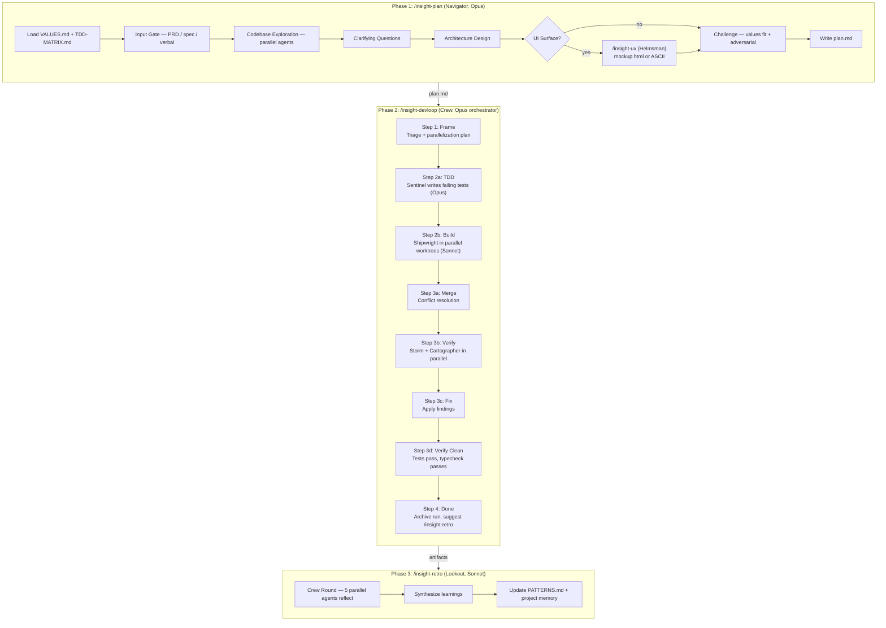
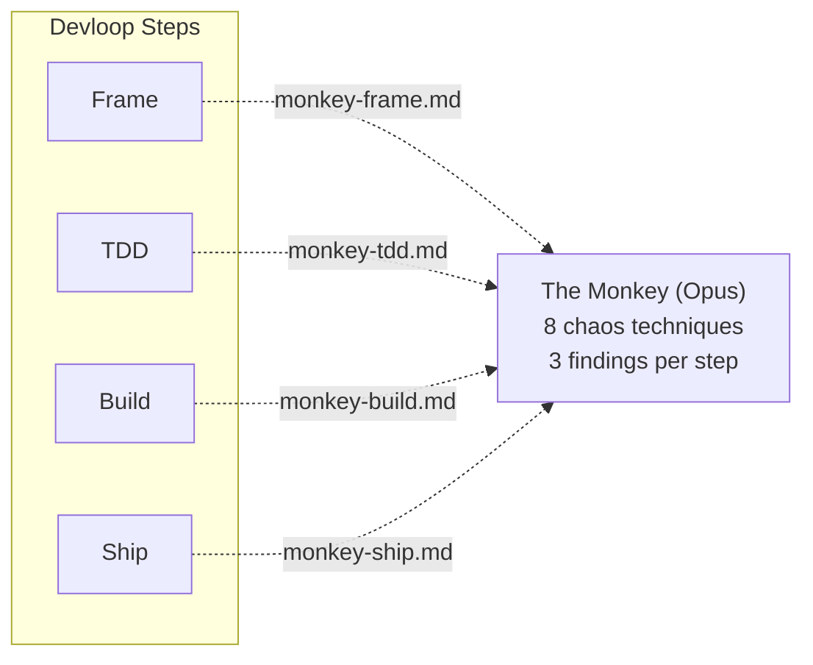
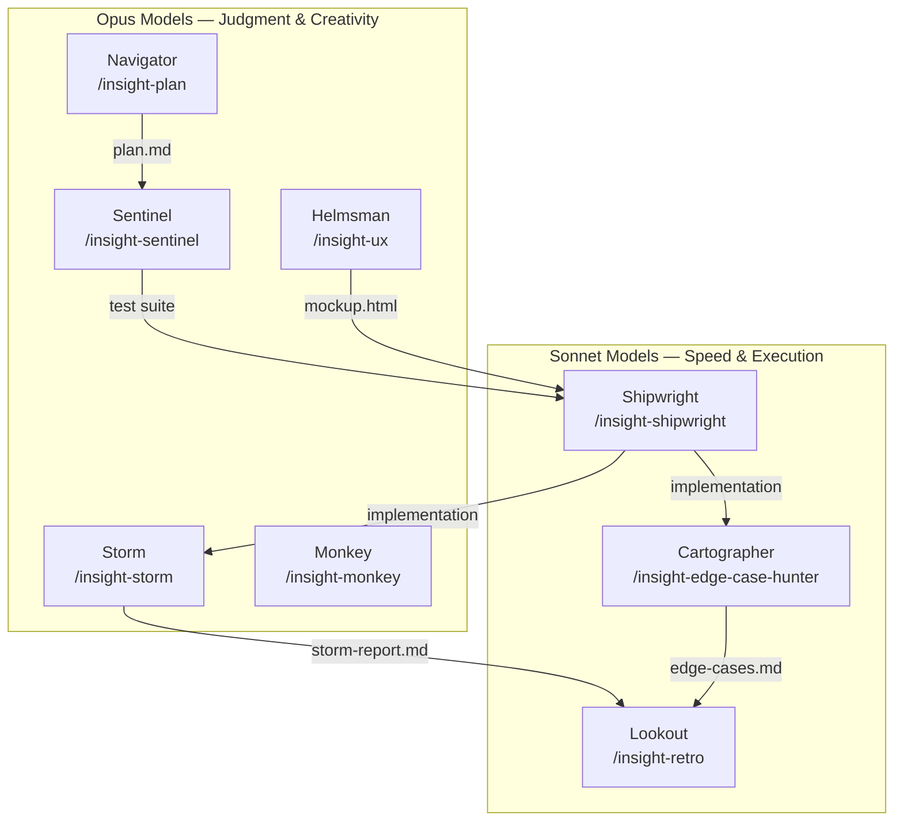
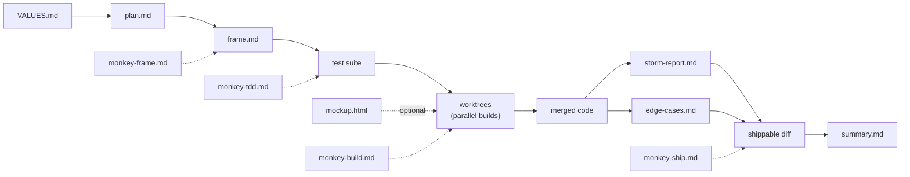

# InsightsLoop Architecture

## Pipeline Overview

The engine runs a three-phase pipeline: **Plan → Build → Reflect**. The Monkey (chaos agent) is present at every step.



## The Monkey — Chaos at Every Step

The Monkey is a real Opus agent launched at every step of the devloop, not inline narrative.



### 8 Chaos Techniques

| # | Technique | What it does |
|---|-----------|-------------|
| 1 | Assumption Flip | Reverse the strongest assumption |
| 2 | Hostile Input | Creative inputs nobody considered |
| 3 | Existence Question | Should this thing exist at all? |
| 4 | Scale Shift | What happens at 10x, 100x, or zero? |
| 5 | Time Travel | What breaks tomorrow or after migration? |
| 6 | Cross-Seam Probe | Where modules meet, what differs? |
| 7 | Requirement Inversion | What if the user wants the opposite? |
| 8 | Delete Probe | What if you delete this entirely? |

## Crew & Model Assignments



**Why the split:** Opus handles judgment calls — planning, adversarial review, chaos testing, UX decisions. Sonnet handles mechanical execution — building from tests, path enumeration, record-keeping. The Sentinel and Shipwright are never the same agent (prevents correlated failure).

## Artifact Flow



## Run Archiving

```
.insightsLoop/
├── config.md                    ← tunables (theme, monkey count, confidence)
├── themes/                      ← pirate.md, naval.md, space.md
├── current/                     ← active run artifacts
└── run-NNNN-feature-name/       ← archived completed runs
    ├── summary.md               ← kept
    ├── plan.md                  ← kept
    ├── mockup.html              ← kept (if exists)
    ├── monkey-*.md              ← kept (all 4)
    └── storm-report.md          ← kept
```

## Speed Mode (/insight-devloopfast)

Same crew, same Monkey. Two differences:

1. **Auto-triage** — small/medium changes skip the frame approval gate
2. **Confidence filter** — findings below 80 confidence go to `filtered-findings.md` instead of blocking

The Monkey still launches at every step. She just doesn't block on low-confidence findings.

## Themes

Themes change voice and vocabulary only — never file paths, technique names, severity levels, or logic.

| Theme | Ship Name | Setting |
|-------|-----------|---------|
| `pirate` | *The Insight* | Salt, timber, articles of agreement |
| `space` | *ISV Insight* | Vacuum, conduits, mission protocols |
| `naval` | *HMS Insight* | Discipline, welds, rules of engagement |
| `none` | — | Default, no roleplay |
